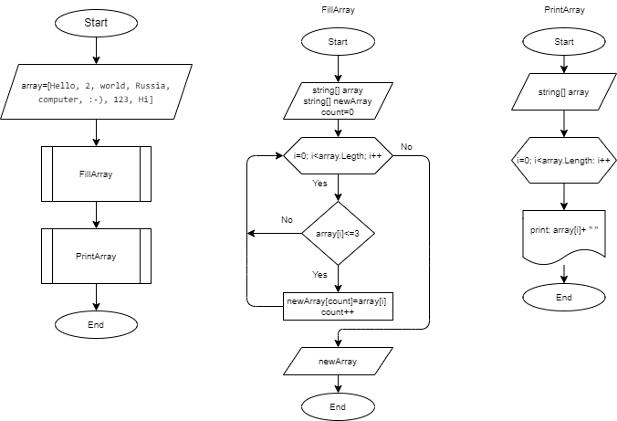

# **Итоговая проверочная работа за 1-й семестр.**
## Задача:
Написать программу, которая из имеющегося массива строк формирует массив из строк, длина которых меньше либо равно 3 символа. Первоначальный массив можно ввести с клавиатуры, либо задать на старте выполнения алгоритма. При решении не рекоммендуется пользоваться коллекциями, лучше обойтись исключительно массивами.

## Представление и реализация:
Для решения задачи, выделяем несколько шагов 
1. **Уточнение условия задачи:** 
*данны несколько строк, которые формируют массив; необходимо выбрать из данного массива строки, длина которых меньше, либо равна трем символам*

2. **Декомпозиция задачи:**
* *вводим с клавиатуры массив строк;*
* *проверяем длину строк;*
* *из строк, длина которых менее трех символов, формируем новый массив;*
* *выводим в консоль получившийся массив.*

3. **Выявляем главный алгоритм:** *главным алгоритмом является поиск строки, длина которой меньше, либо равна трем символам.*
4. **Составление блок-схемы.** 

5. **Написание кода на языке програмирования C#.**
*для написания программы используем **[VS code](https://code.visualstudio.com/download)***
* Вводим массив строк string[] array;
* Создаем новый массив string[] newArray;
* Создаем метод FillArray,который проверяет строки первого массива на соответствие условия- количество символок меньше или равна трем.
* Создаем метод PrintArray, который выводит массив в консоль.
* Применяем метод FillArray.
* Применяем метод PrintArray.
6. Тестируем написаный код.
7. Отправляем решение в реппозиторий на **[GitHub](https://github.com/DmitryZhuravel/Control_work)**